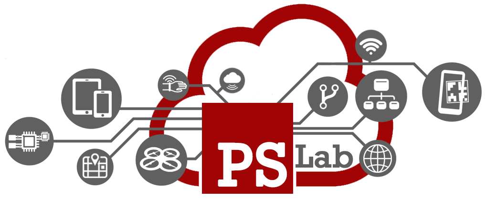
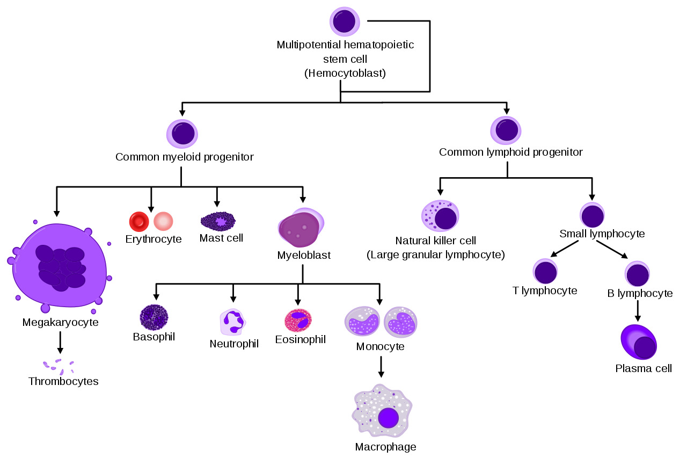
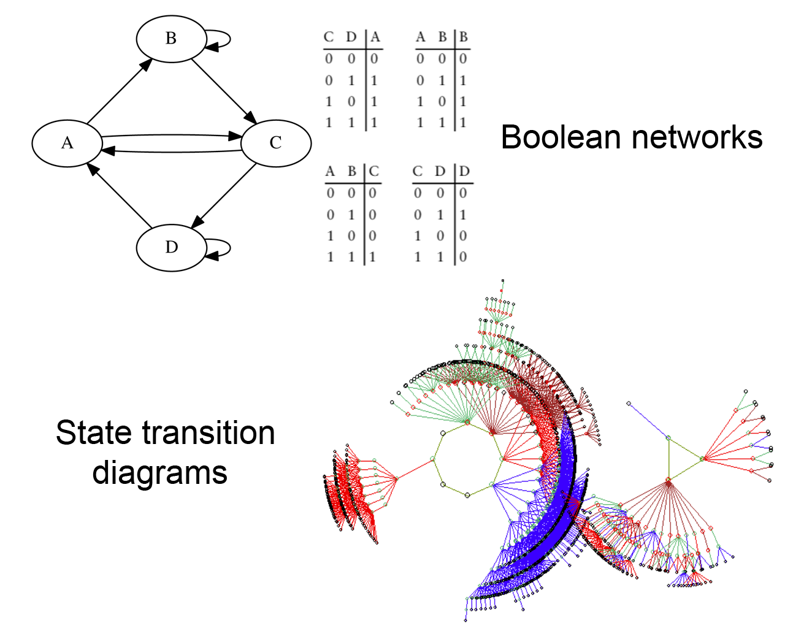
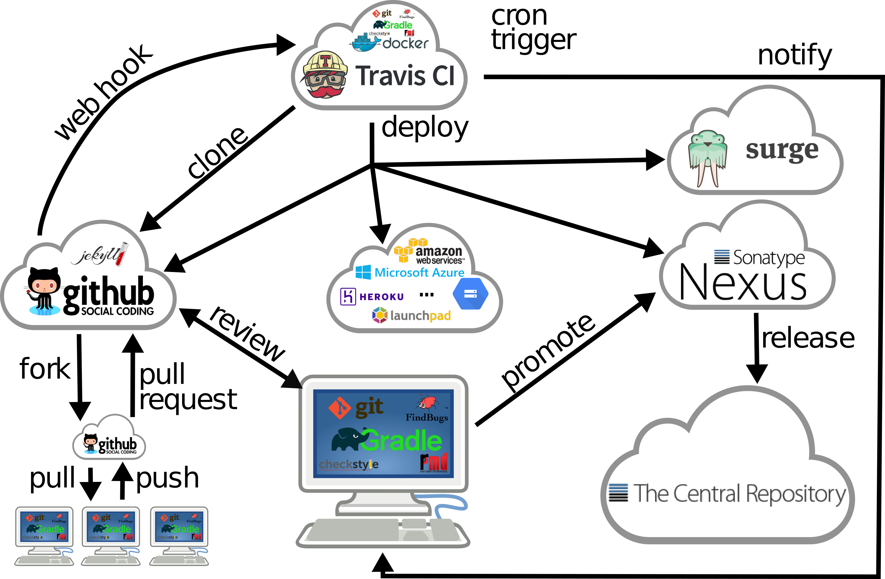

+++
title = "PSLab"
outputs = ["Reveal"]
[reveal_hugo]
theme = "blood"
slide_number = "true"
+++



### Pervasive Software lab

Dipartimento di Informatica - Scienza e Ingegneria
Università di Bologna - Campus Cesena

---



### Laboratorio di Ricerca

> Il software come elemento pervasivo della realtà

* Ingegnerizzazione di approcci ideati e studiati a livello di ricerca

* Condivisione e riuso della conoscenza

* Casi di studio real-world

---



### Sistemi pervasivi complessi

naturali
 <---> human in the loop
 <---> artificiali

---



#### Biological cell differentiation 

 Prominent example of complex dynamics 

  

---



##### Genetic Regulatory Networks models 

  

---



###### ... as control software for robots 
<video width="120%" height="120%" autoplay controls loop><source data-src="video/robot.mp4" type="video/mp4" /></video>

---



### Pervasive Healthcare

* Infrastrutture software IoT a supporto dell'attività clinica
 * Personal Medical Digital Assistant Agents
 * Digital Twin per Ospedale 4.0

* Collaborazione con AUSL Romagna
 * Progetto TraumaTracker
 * Progetto T4C (Tracking for Care)
 * Progetto CERERE e DIANA

---



### Augmented Reality

> Studio, Sperimentazione e Ingegnerizzazione di Sistemi Software Pervasivi orientati alla Realtà Aumentata

* Dotazione HW
 * Tablet avanzati con supporto ARCore
 * Smart Glasses (Vuzix m100/m300 e Epson Moverio BT-200)
 * Visori per MR (Meta2)
 * ...

---



### Mixed Reality Augmented Environments

* Augmented Worlds e Infrastruttura MiRAgE
 * Integrazione di tecniche Agent-based

* Casi di Studio
 * Museo della Regina, Cattolica
 * Rocca delle Caminate, Meldola
 * Ospedale Bufalini Cesena

---



### Aggregate Computing

<iframe width="850" height="500" src="https://www.youtube.com/embed/arA42RHTA9Q" frameborder="0" allow="accelerometer; autoplay; encrypted-media; gyroscope; picture-in-picture" allowfullscreen></iframe>

---

<video width="120%" height="120%" autoplay controls loop><source data-src="video/stampede.mp4" type="video/webm" /></video>

---

---



### Area 4.0 (Gennaio 2020)

* Laboratorio interdisciplinare ICT @ Campus Cesena
 * Display interattivi 80"
 * Research Meeting Areas
 * Makers-oriented Space
 
* Spazio dedicato all'ingegnerizzazione di ambienti di Mixed Reality
 * Visori di AR/MR/VR avanzati
 
* Tesi e Tirocini interdisciplinari