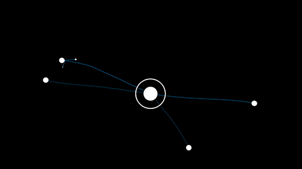
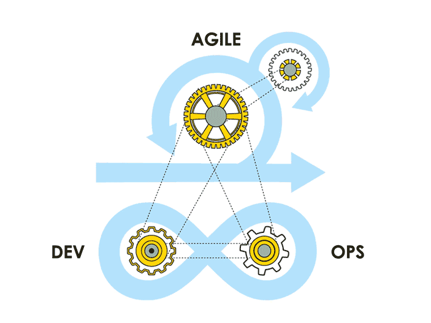

+++
title = "From nature inspiration to aggregate computing"
outputs = ["Reveal"]
[reveal_hugo]
theme = "blood"
slide_number = "true"
+++



### Pervasive software lab

#### Where people tame complexity

---



### Sistemi pervasivi complessi

naturali
 <---> human in the loop
 <---> artificiali

---



# TODO MICHELE

---



# TODO Angelo: healthcare

---



# TODO Angelo: augmented

---



### Nuovi paradigmi di programmazione
